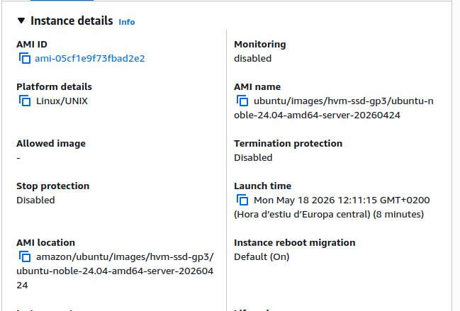
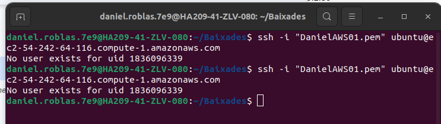
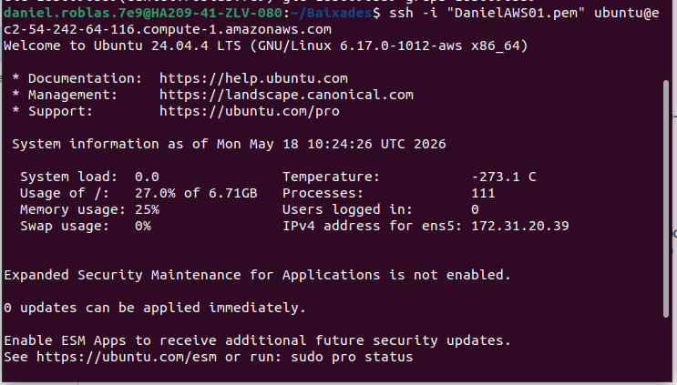
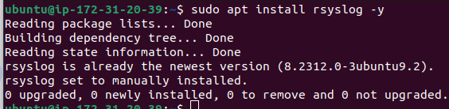
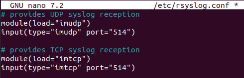
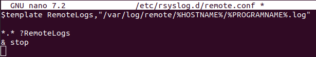

Creació de la instancia:

| Configuració | Valor |
| :---- | :---- |
| Nom | logs01 |
| SO | Ubuntu Server 24.04 |
| Tipo | t3.micro |
| IP privada | 10.0.1.30 |
| Seguretat | Port 514 obert |

Una vegada creades les claus pem., les guardem a la carpeta compartida del drive del grup i accedim a la maquina:

Ara instal·lem el servei que ens permetra realitzar els logs de tots els servidors:

Ara editem el fitxer de configuració de logs del servidor /etc/rsyslog.conf i descomentarem algunas líneas:

Ara crearem les carpetes per als logs remots en el fitxer /etc/rsyslog.d/remote.conf :

Això fa:

- una carpeta per servidor.  
- logs separats automàticament.

Reiniciem el servei:

